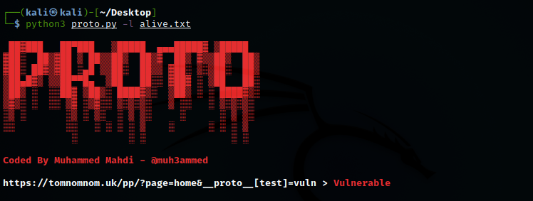

# proto
A fast tool to scan prototype pollution vulnerability

### Syntax
python3 proto.py -l alive.txt

### Requirements
1. Selenium
2. Google Chrome Webdriver

**Note : Edit the webdriver location**
